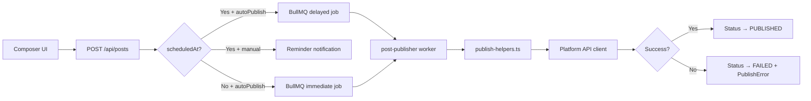

# Platform Publishing Pipeline

Use this skill when modifying, debugging, or extending the content publishing flow.

## Pipeline Overview



---

## Key Files

| Stage | File | Role |
|-------|------|------|
| API | `src/app/api/posts/route.ts` | Creates Post records, enqueues jobs |
| Queue | `src/lib/queue.ts` | `schedulePost()`, `publishNow()` helpers |
| Queue defs | `src/lib/bullmq/queues.ts` | `postPublishQueue`, `PostPublishJobData` |
| Worker | `src/workers/post-publisher.ts` | Job processor, orchestrates publishing |
| Helpers | `src/workers/publish-helpers.ts` | Payload building, platform dispatch |
| Platform APIs | `src/lib/platform-api/*-api.ts` | HTTP calls to each platform |
| Validation | `src/lib/validate-post.ts` | Pre-publish content validation |
| Validation rules | `src/lib/validation/` | Platform-specific constraints |

---

## Status Transitions

```
DRAFT → SCHEDULED → PUBLISHING → PUBLISHED
                  ↘             ↘ FAILED
```

- **DRAFT**: Created without `scheduledAt`, or `autoPublish=false`
- **SCHEDULED**: Has `scheduledAt` + `autoPublish=true`
- **PUBLISHING**: Worker has picked up the job (set in `post-publisher.ts`)
- **PUBLISHED**: Platform API returned success
- **FAILED**: Platform API error — details saved to `PublishError` model

## Post Architecture

Each post targets **exactly one platform**. Multi-platform posts are separate `Post` records linked by `linkedGroupId`:

```
Post (Instagram) ─┐
Post (TikTok)    ─┼── linkedGroupId: "abc-123"
Post (Facebook)  ─┘
```

---

## How Publishing Works

### 1. API Creates Posts

`POST /api/posts` creates one `Post` per platform account, then calls:
- `schedulePost()` — for delayed publish
- `publishNow()` — for immediate publish
- `schedulePublishReminder()` — for manual publish mode

### 2. Worker Picks Up Job

`post-publisher.ts` → `processPostPublish()`:
1. Acquires a publish lock (prevents double-publish)
2. Sets status to `PUBLISHING`
3. Checks pre-conditions (video required, account connected)
4. Calls `publishPost()` which delegates to platform-specific helpers

### 3. Platform Dispatch

`publish-helpers.ts` → `publishSinglePlatform()`:
- Builds the platform-specific payload via `buildPublishPayload()`
- Calls the appropriate API function (e.g., `publishTikTokVideo()`)
- Handles token refresh if needed
- Returns `SinglePublishResult` with success/failure info

### 4. Success / Failure

On success:
- Status → `PUBLISHED`, `publishedAt` set
- Activity logged
- Push notification sent

On failure:
- `PublishError` record created with error details
- Status → `FAILED`
- Notification sent
- Dead letter queue for persistent failures

---

## Adding Publishing for a New Platform

1. Create API client with `publish<Platform>Post()` in `src/lib/platform-api/<name>-api.ts`
2. Add case to `publishSinglePlatform()` in `src/workers/publish-helpers.ts`
3. Add payload builder logic to `buildPublishPayload()` in the same file
4. Add validation rules in `src/lib/validation/rules/<name>.ts`
5. Test with `autoPublish=true` + no `scheduledAt` (immediate publish)

---

## Debugging Tips

| Symptom | Check |
|---------|-------|
| Post stuck in SCHEDULED | Worker running? Check `docker compose logs -f worker` |
| Post stuck in PUBLISHING | Publish lock not released — check Redis keys |
| FAILED with no error | Check `PublishError` table and worker logs |
| Token expired | `token-refresh-worker.ts` should catch these proactively |
| Media upload timeout | Increase `UPLOAD_TIMEOUT_MS` in `fetch-with-timeout.ts` |

## Reference Files

| Purpose | Path |
|---------|------|
| Posts API | `src/app/api/posts/route.ts` |
| Queue helpers | `src/lib/queue.ts` |
| Post publisher worker | `src/workers/post-publisher.ts` |
| Publish helpers | `src/workers/publish-helpers.ts` |
| Publish lock | `src/lib/publish-lock.ts` |
| Dead letter | `src/lib/resilience/dead-letter.ts` |
| Content validation | `src/lib/validate-post.ts` |
