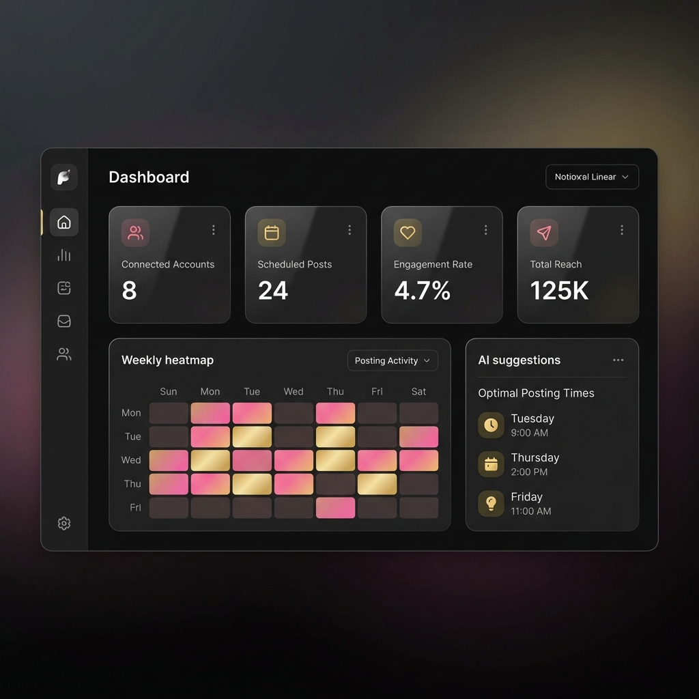
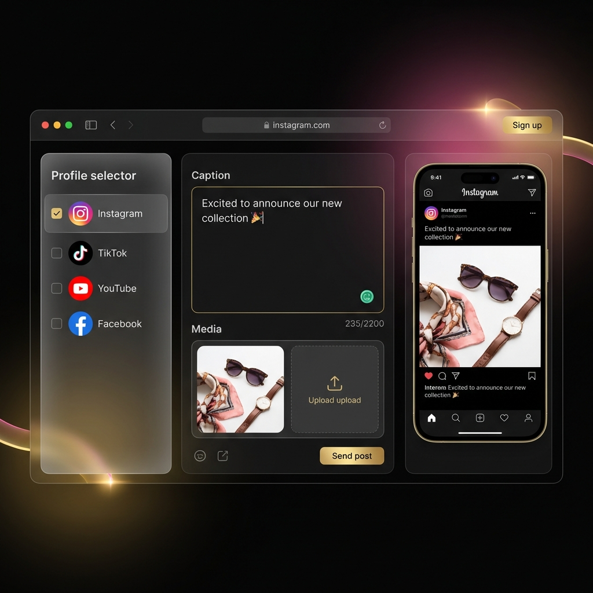
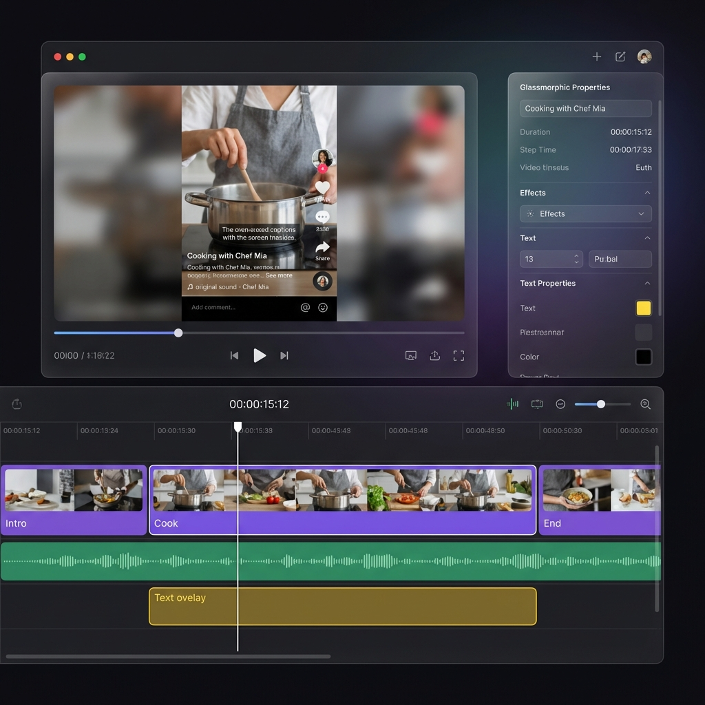
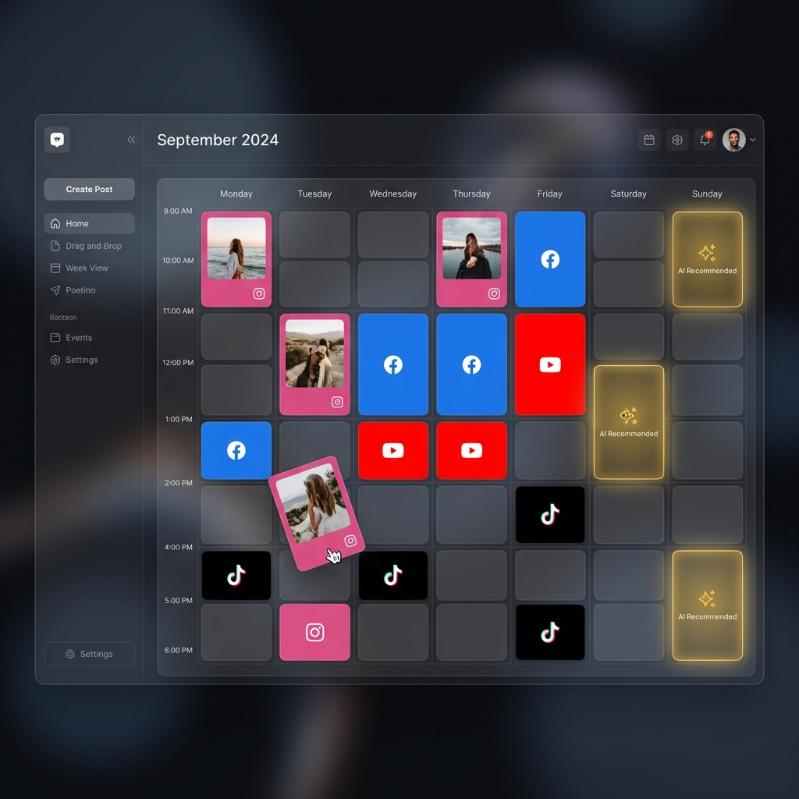

<p align="center">
  
</p>

<h1 align="center">SocialiseIT</h1>

<p align="center">
  <strong>Self-hosted social media management platform with AI-powered content creation</strong>
</p>

<p align="center">
  <a href="#features">Features</a> •
  <a href="#screenshots">Screenshots</a> •
  <a href="#quick-start">Quick Start</a> •
  <a href="#tech-stack">Tech Stack</a> •
  <a href="#license">License</a>
</p>

<p align="center">
  
  
  
  
</p>

---

A powerful, self-hosted alternative to VistaSocial, Hootsuite, and Buffer. Built for agencies and brands who want full control over their social media operations without monthly SaaS fees.

## Features

### Multi-Platform Publishing
Publish to **Instagram**, **TikTok**, **YouTube**, **Facebook**, **Pinterest**, **LinkedIn**, **Bluesky**, and **Google Business** from a single unified composer with platform-specific optimizations.

### AI-Powered Content Engine
- **Brand Voice AI**: Analyzes your content to maintain consistent tone, vocabulary, and style
- **Smart Caption Generation**: Context-aware captions with virality scoring
- **Optimal Posting Times**: ML-driven predictions for maximum engagement (+40% typical lift)
- **AI Comment Responder**: Sentiment-aware automated responses

### Multi-Track Video Editor
Built on **Remotion**, create professional short-form videos directly in the browser:
- Non-linear timeline with drag-to-reposition clips
- Audio tracks with waveform visualization
- Animated text overlays
- Import trending audio from TikTok/Instagram URLs
- Server-side rendering via FFmpeg

### Content Calendar
Visual week/month view with drag-and-drop scheduling, AI-suggested time slots, and platform color coding.

### Analytics & ROI Tracking
Cross-platform performance metrics with e-commerce attribution. Connect **Shopify** or **WooCommerce** to track revenue per post.

### Social Listening
Real-time brand mention tracking, sentiment analysis, competitor benchmarking, and hashtag monitoring.

### Team Collaboration
Role-based access control (Owner, Admin, Editor, Viewer), activity logging, and workspace isolation for agencies managing multiple brands.

### More Features
- Media Library with folder organization
- Content Pillars & strategic distribution tracking
- UGC discovery and permission workflows
- Bulk CSV import for content migration
- DM automation & lead capture
- PWA with push notifications
- Export reports (PDF/CSV)
- WCAG 2.2 AA accessibility

## Screenshots

<details>
<summary><strong>Post Composer</strong> - 3-column layout with live platform previews</summary>
<br/>

</details>

<details>
<summary><strong>Video Editor</strong> - Multi-track NLE with Remotion</summary>
<br/>

</details>

<details>
<summary><strong>Content Calendar</strong> - Visual scheduling with AI suggestions</summary>
<br/>

</details>

## Quick Start

### Prerequisites
- Docker & Docker Compose
- Node.js 20+ (for local development)

### 1. Clone and Configure

```bash
git clone https://github.com/MerlinStacks/socaliseit.git
cd socialiseit
cp stack.env.example stack.env
```

Edit `stack.env` with your configuration:
- Database credentials
- OAuth app credentials (Meta, Google, TikTok, etc.)
- OpenRouter API key (for AI features)

### 2. Start with Docker

```bash
docker-compose up -d
```

The app will be available at `http://localhost:3000`

### 3. Initial Setup

1. Create your account at `/register`
2. Connect your first social account in Settings
3. Start creating content!

## Tech Stack

| Layer | Technology |
|-------|------------|
| **Framework** | Next.js 16 (App Router, Turbopack) |
| **Database** | PostgreSQL + Prisma 7.3 |
| **Video** | Remotion 4.0 + FFmpeg |
| **Queue** | BullMQ + Redis |
| **Auth** | NextAuth.js (OAuth + Credentials) |
| **Styling** | Tailwind CSS 4.0 |
| **State** | Zustand + React Query |
| **Container** | Docker Compose |

## Project Structure

```
socialiseit/
├── app/                    # Next.js application
│   ├── src/
│   │   ├── app/           # App Router pages & API routes
│   │   ├── components/    # React components
│   │   ├── lib/           # Business logic & utilities
│   │   └── remotion/      # Video compositions
│   └── prisma/            # Database schema
├── docs/                   # Documentation
└── docker-compose.yml      # Container orchestration
```

## Development

```bash
cd app
npm install
npm run dev
```

Run database migrations:
```bash
npx prisma migrate dev
```

Generate Prisma client:
```bash
npx prisma generate
```

## Roadmap

- [ ] LinkedIn native video support
- [ ] Threads (Meta) integration
- [ ] AI-powered A/B testing
- [ ] White-label client portals
- [ ] Mobile app (Capacitor)

## Contributing

Contributions are welcome! Please read our contributing guidelines before submitting PRs.

## License

This project is licensed under the MIT License - see the [LICENSE](LICENSE) file for details.

---

<p align="center">
  Built with ☕ by <a href="https://github.com/MerlinStacks">SLDevs</a>
</p>
