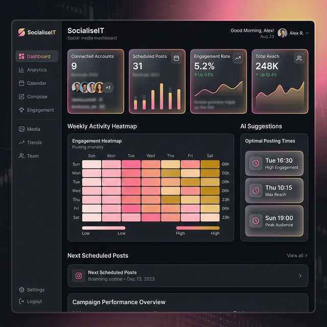
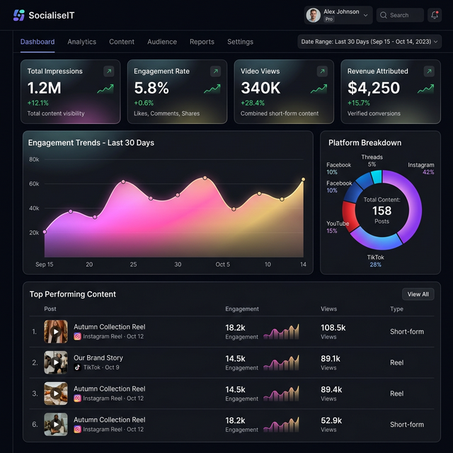
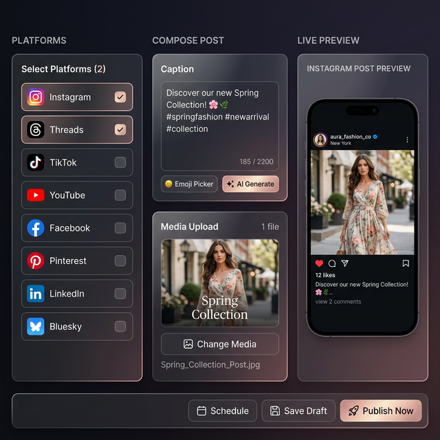
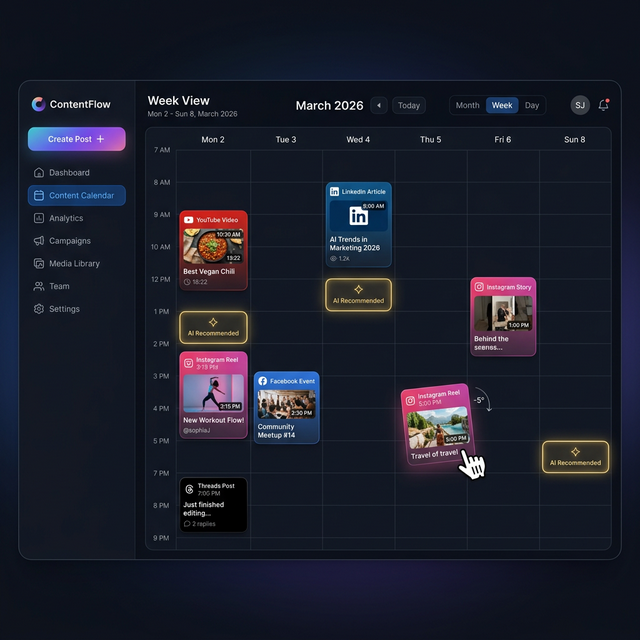
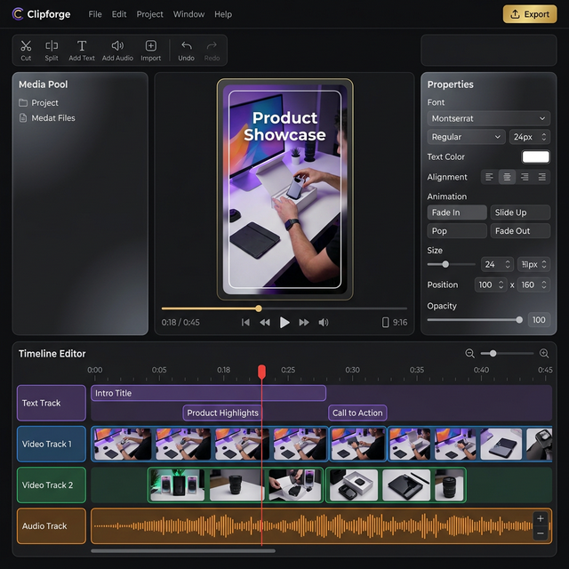
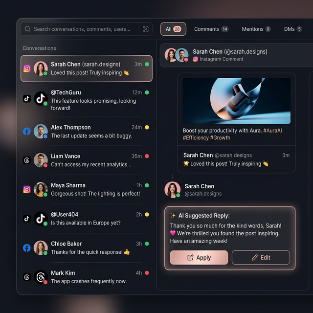
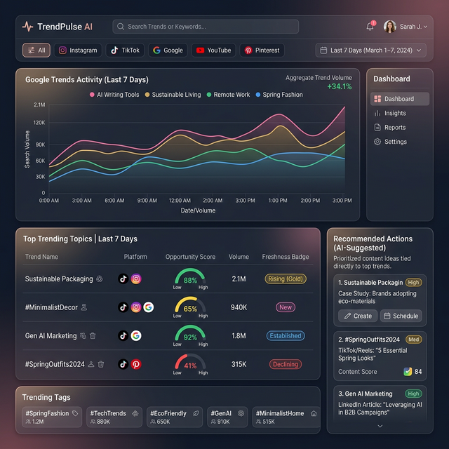
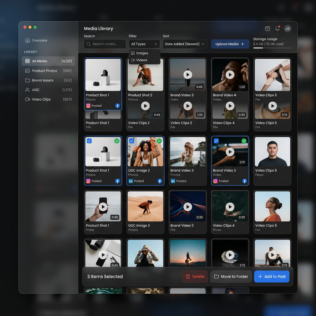

<p align="center">
  
</p>

<h1 align="center">SocialiseIT</h1>

<p align="center">
  <strong>Self-hosted social media management platform with AI-powered content creation</strong>
</p>

<p align="center">
  <a href="#features">Features</a> •
  <a href="#screenshots">Screenshots</a> •
  <a href="#quick-start">Quick Start</a> •
  <a href="#tech-stack">Tech Stack</a> •
  <a href="#development">Development</a> •
  <a href="#roadmap">Roadmap</a> •
  <a href="#license">License</a>
</p>

<p align="center">
  
  
  
  
  
  
</p>

---

A powerful, self-hosted alternative to VistaSocial, Hootsuite, and Buffer. Built for agencies and brands who want full control over their social media operations without monthly SaaS fees.

## Features

### 📱 Multi-Platform Publishing
Publish to **Instagram**, **TikTok**, **YouTube**, **Facebook**, **Pinterest**, **LinkedIn**, **Threads**, **Bluesky**, and **Google Business** from a single unified composer with platform-specific optimizations and validation.

### 🤖 AI-Powered Content Engine
- **Brand Voice AI** — Analyzes your content to maintain consistent tone, vocabulary, and style
- **Smart Caption Generation** — Context-aware captions with virality scoring
- **Optimal Posting Times** — ML-driven predictions for maximum engagement (+40% typical lift)
- **AI Comment Responder** — Sentiment-aware automated responses with tone matching
- **AI Marketing Strategist (CMO Agent)** — Weekly strategy briefs, proactive crew dispatch, and automated ad suggestions

### 🎬 Multi-Track Video Editor
Built on **Remotion**, create professional short-form videos directly in the browser:
- Non-linear timeline with drag-to-reposition clips
- Audio tracks with waveform visualization
- Animated text overlays with customizable animations
- Import trending audio from TikTok/Instagram URLs
- Server-side rendering via FFmpeg

### 📅 Content Calendar
Visual week/month view with drag-and-drop scheduling, AI-suggested time slots with golden indicators, platform color coding, and click-to-create functionality.

### 📊 Analytics & ROI Tracking
Cross-platform performance metrics with e-commerce attribution:
- **Video-specific metrics** — Views, watch time, skip rate, Reels analytics
- **Platform breakdown** — Per-platform engagement distribution
- **Revenue attribution** — Connect **Shopify** or **WooCommerce** to track revenue per post
- **Top performing content** — Ranked by engagement rate with exportable reports (PDF/CSV)

### 📈 Trend Intelligence
- **Google Trends integration** — Real-time trend discovery with opportunity scoring
- **Freshness-weighted scoring** — Differentiates new vs established trends
- **Hashtag monitoring** — Track performance of hashtags across platforms

### 👂 Social Listening
Real-time brand mention tracking, sentiment analysis, competitor benchmarking, and hashtag monitoring with actionable insights.

### 🏢 Competitor Intelligence
Dedicated competitor tracking page with side-by-side benchmarking, content strategy analysis, and automated competitive reports.

### 👥 Team Collaboration
Role-based access control (Owner, Admin, Editor, Viewer), activity logging, workspace isolation for agencies managing multiple brands, and team invitations.

### ✨ More Features
- 🖼️ Media Library with folder organization and multi-select actions
- 📋 Content Pillars & strategic distribution tracking
- 📸 UGC discovery and permission workflows
- 📤 Bulk CSV import for content migration
- 💬 DM automation & lead capture
- 📱 PWA with push notifications
- 🔐 Two-factor authentication (TOTP)
- ♿ WCAG 2.2 AA accessibility
- 📊 Export reports (PDF/CSV)

## Screenshots

<details>
<summary><strong>📊 Analytics Dashboard</strong> — Cross-platform metrics with video performance tracking</summary>
<br/>

</details>

<details>
<summary><strong>✏️ Post Composer</strong> — 3-column layout with live platform previews</summary>
<br/>

</details>

<details>
<summary><strong>📅 Content Calendar</strong> — Visual scheduling with AI-recommended slots</summary>
<br/>

</details>

<details>
<summary><strong>🎬 Video Editor</strong> — Multi-track NLE with Remotion</summary>
<br/>

</details>

<details>
<summary><strong>💬 Engagement Inbox</strong> — Unified inbox with AI-powered replies</summary>
<br/>

</details>

<details>
<summary><strong>📈 Trend Intelligence</strong> — Google Trends integration with opportunity scoring</summary>
<br/>

</details>

<details>
<summary><strong>🖼️ Media Library</strong> — Organized asset management with folder structure</summary>
<br/>

</details>

## Quick Start

### Prerequisites
- Docker & Docker Compose
- Node.js 20+ (for local development)

### 1. Clone and Configure

```bash
git clone https://github.com/MerlinStacks/socaliseit.git
cd socialiseit
cp stack.env.example stack.env
```

Edit `stack.env` with your configuration:
- Database credentials
- OAuth app credentials (Meta, Google, TikTok, etc.)
- OpenRouter API key (for AI features)
- Stripe keys (for billing, optional)

### 2. Start with Docker

```bash
docker-compose up -d
```

The app will be available at `http://localhost:6754`

### 3. Initial Setup

1. Create your account at `/register`
2. Connect your first social account in Settings
3. Start creating content!

## Tech Stack

| Layer | Technology |
|-------|------------|
| **Framework** | Next.js 16.1 (App Router, Turbopack) |
| **UI** | React 19, Tailwind CSS 4 |
| **Language** | TypeScript 5 |
| **Database** | PostgreSQL 16 + Prisma 7.3 |
| **Video** | Remotion 4.0 + FFmpeg |
| **Queue** | BullMQ + Redis 7.2 |
| **Auth** | NextAuth.js (OAuth + Credentials + TOTP 2FA) |
| **Validation** | Zod + Valibot |
| **State** | Zustand + React Query |
| **Billing** | Stripe |
| **Container** | Docker Compose |

## Project Structure

```
socialiseit/
├── app/                    # Next.js application
│   ├── src/
│   │   ├── app/           # App Router pages & API routes
│   │   ├── components/    # React components
│   │   ├── lib/           # Business logic & utilities
│   │   ├── remotion/      # Video compositions
│   │   └── workers/       # BullMQ background workers
│   └── prisma/            # Database schema & migrations
├── docs/                   # Documentation & screenshots
├── docker-compose.yml      # Production orchestration
└── docker-compose.dev.yml  # Development orchestration
```

## Development

```bash
cd app
npm install
npm run dev
```

Run database migrations:
```bash
npx prisma migrate dev
```

Generate Prisma client:
```bash
npx prisma generate
```

Run tests:
```bash
npm run test            # Unit tests (Vitest)
npm run test:e2e        # E2E tests (Playwright)
npm run test:coverage   # Coverage report
```

## Roadmap

- [ ] AI-powered A/B testing for post variants
- [ ] White-label client portals for agencies
- [ ] Mobile app (Capacitor)
- [ ] Webhooks marketplace for third-party integrations
- [ ] Multi-language content adaptation
- [ ] Advanced video templates library

## Contributing

Contributions are welcome! Please read our [contributing guidelines](CONTRIBUTING.md) before submitting PRs.

## License

This project is licensed under the MIT License — see the [LICENSE](LICENSE) file for details.

---

<p align="center">
  Built with ☕ by <a href="https://github.com/MerlinStacks">SLDevs</a>
</p>
